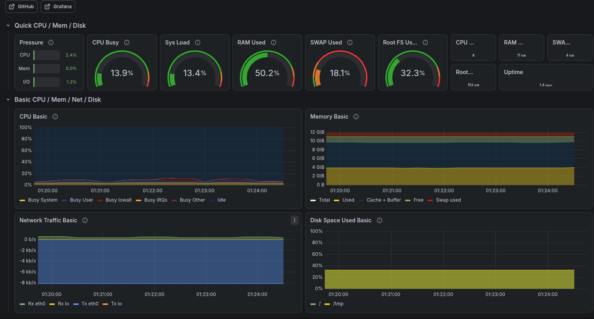

# 📊 Local Infrastructure Monitoring Stack


A production-ready, cross-platform infrastructure monitoring setup using Docker Compose. This stack captures host machine metrics (CPU, Memory, Disk, Network) and visualizes them in real-time on pre-configured Grafana dashboards.
(Tested on linux sys-should work on Mac-OS and Windows Also).
---

## 🏗️ Architecture Components

* **Docker Compose**: Orchestrates and manages the lifecycle of the monitoring stack services.
* **Prometheus**: Time-Series Database (TSDB) that pulls metrics via periodic scraping.
* **Grafana**: Advanced visualization platform used to build interactive dashboards and configure alerts.
* **Node Exporter**: A lightweight system metrics collector running in host mode to gather real hardware data.

---

## 📁 Project Structure

Ensure the following files are placed in the same directory:

```text
├── docker-compose.yml     # Container definitions, networks, and persistent volumes
├── prometheus.yml         # Prometheus scraping intervals and target configurations
└── README.md              # This documentation file
```

---

## 🚀 Setup & Installation (Step-by-Step)

### 1. Launch the Stack
Open your terminal in the project directory and execute the following command:
```bash
docker-compose up -d
```
*Note: This command downloads the official stable images and runs the entire stack seamlessly in the background.*

### 2. Verify Component Status
* **Prometheus**: Accessible at [http://localhost:9090](http://localhost:9090). Navigate to `Status -> Targets` to ensure all endpoints are `UP` (Green).
* **Grafana**: Accessible at [http://localhost:3000](http://localhost:3000).
  * Default Credentials: 
    * **Username:** `admin`
    * **Password:** `admin`
  * *You will be prompted to change the password upon your first login. You can skip this step for local testing.*

### 3. Connect Prometheus to Grafana
1. In the Grafana sidebar, navigate to **Connections** > **Data Sources**.
2. Click **Add data source** and select **Prometheus**.
3. Under the **Connection URL** field, enter: `http://prometheus:9090` *(Leverages Docker's internal DNS routing)*.
4. Scroll to the bottom of the page and click **Save & test**. Ensure a green success banner appears.

### 4. Import the Community Dashboard
To instantly deploy a professional hardware dashboard without building charts manually:
1. In the Grafana sidebar, click the **+** (Plus) icon in the top right corner (or go to **Dashboards** -> **New** -> **Import**).
2. In the **Import via grafana.com** field, enter the ID: **`1860`** and click **Load**. *(This is the gold standard dashboard for Node Exporter)*.
3. At the bottom of the form, choose the **Prometheus** data source you configured in the previous step.
4. Click **Import**.

---

## 📈 Verifying Live Metrics
To confirm that Grafana is actively monitoring your true host system hardware:
* **Time Range**: In the top-right corner of your dashboard, set the time range to `Last 5 minutes` and the auto-refresh rate to `5s`.
* **Load Test**: Launch a demanding local application or a browser with multiple tabs. Within 60 seconds, you should observe an identical spike in the **CPU Usage** graph inside Grafana.


---

## 🔒 Security Notice
**Warning:** The default setup binds ports globally. Do not expose ports `3000` or `9090` to the public internet without a reverse proxy (e.g., Nginx) or basic authentication mechanisms in place.
