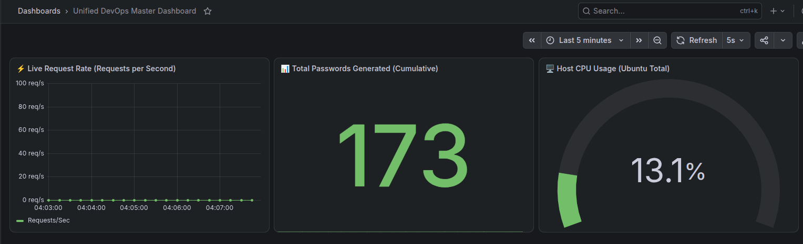
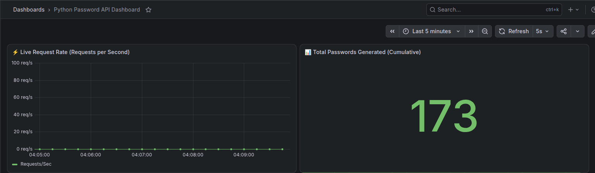

# 📊 Cross-Platform Infrastructure & Application Monitoring Stack


A production-ready, highly secure, and cross-platform DevOps monitoring ecosystem orchestrated via Docker Compose. This stack provides complete visibility by capturing **host-level hardware metrics** (CPU, Memory, Disk, Network) while simultaneously scraping **custom application metrics** (Request counts, latency, and business logic tokens) from a native Python Flask API.

*(Tested on Linux/Ubuntu. Native compatibility extends seamlessly to macOS and Windows WSL2 environments).*

---

## 🏗️ Architecture Components

* **Docker Compose**: Orchestrates and manages the isolated lifecycle of your service containers.
* **Prometheus (v2.55.1 LTS)**: Time-Series Database (TSDB) handling periodic target scraping and data retention.
* **Grafana**: Advanced visualization and analytical telemetry interface for charts, dashboards, and thresholds.
* **Node Exporter**: Lightweight hardware metrics aggregator interfacing safely with core OS paths.
* **Python Password API**: Custom-built Python Flask web service embedding internal Prometheus instrumentation (`Counter` / `Histogram`) to export software runtime performance data.

---

## 📁 Project Structure

Ensure your workspace directory maintains the following file layout:

```text
├── docker-compose.yml     # Complete service container specifications & local port bindings
├── prometheus.yml         # Scrape intervals, target configurations, and container routing
├── app.py                 # Instrumented Python password generator application source
├── requirements.txt       # Hardcoded Python dependencies (Flask, prometheus-client)
├── Dockerfile             # Multi-stage container recipe for the Python application service
├── .gitignore             # Strict layer preventing database storage folders from leaking to GitHub
├── Dashboard.png          # Node Exporter visualization screenshot
├── DevOpsMasterDB.png     # Unified DevOps master monitoring view screenshot
└── README.md              # This central documentation file
```

---

## 🚀 Setup & Installation (Step-by-Step)

### 1. Launch the Complete Stack
Open your terminal inside the project directory and build/run the ecosystem in detached mode:
```bash
docker compose up -d --build
```
*Note: The `--build` flag instructs Docker to compile your local Python application from the Dockerfile on its initial launch or whenever source files change.*

### 2. Verify Scraper Targets
Open your browser and navigate to the Prometheus web utility to verify connection mapping:
* **Endpoint Status**: Access [http://127.0.0](http://127.0.0).
* Confirm that all three core scraper engines (`prometheus`, `node-exporter`, and `password-api`) display a healthy **`UP`** state (Green).

### 3. Generate Simulated Application Traffic
To prime your custom dashboards with live application telemetry, trigger the Python API loop to generate dynamic encryption strings:
* Visit the runtime endpoint: [http://127.0.0](http://127.0.0)
* **Action Required**: Refresh your browser page **15–20 times** sequentially. This generates live volume metrics (`app_requests_total`) to feed the analytical graphs.

### 4. Configure & Launch Grafana Dashboards
Access the central monitoring dashboard UI at [http://127.0.0.1:3000](http://127.0.0.1:3000).
* **Initial Login**: Use username `admin` and password `admin`. Complete or skip the mandatory password change prompt.
* **Connect Prometheus**: Navigate to `Connections -> Data Sources -> Add Data Source -> Prometheus`. Enter `http://prometheus:9090` into the connection URL field and click **Save & test**.

---

## 📊 Dashboard Visualizations

This project leverages three unique visual layouts to parse system telemetry:

### Option A: The Hardware Level (Node Exporter)
Import Dashboard ID **`1860`** inside Grafana to view total system hardware statistics.




### Option B: The Unified Master View
Import your custom `dashboard.json` code using the **Import via panel JSON** window inside Grafana to generate a unified operations platform. This binds hardware consumption metrics and application-level traffic queries into a single master view.

---

## 🔒 Security Notice & Hardening
**Production Architecture Warning:** This stack utilizes hardened loopback configurations. Inside the `docker-compose.yml` manifest, all external port allocations are bound directly to `127.0.0.1`:
* `127.0.0.1:3000:3000` (Grafana UI Protection)
* `127.0.0.1:9090:9090` (Prometheus API Engine Protection)
* `127.0.0.1:5000:5000` (Python API Port Protection)

This configuration prevents automated network sniffers, public bots, and external unauthorized IPs from sweeping your raw metrics or attacking your application screens. If remote external accessibility is required later, deploy a secure reverse proxy layer (e.g., Nginx, Traefik) equipped with strict SSL/TLS encryption certificates.
